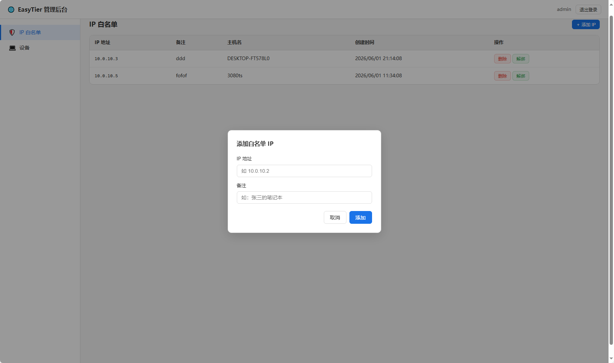

# EasyTier Admin — 自定义管理面板 + 核心融合镜像

## 项目简介

本项目是 [EasyTier](https://github.com/EasyTier/EasyTier) （v2.4.5）的二次发行版，将 `easytier-core`（VPN 组网核心）与 `easytier-web`（管理后台）打包为单一 Docker 镜像，开箱即用。

与官方镜像相比，本镜像额外提供了一个**自定义 Admin UI**（`admin-frontend/index.html`），内置 IP 白名单、设备管理、登录鉴权等功能，适合需要精细化访问控制的部署场景。

原始项目 EasyTier 遵循 LGPL-3.0 许可证，本项目为衍生作品。

## 核心特性

- **单镜像融合**：`easytier-core` + `easytier-web` + 自定义 Admin UI，一个容器搞定一切
- **官方客户端兼容**：实测 `easytier` 官方客户端 `2.3.2` 及 `2.4.5` 均可正常连接与管理
- **IP 白名单机制**：仅允许指定 IP 的客户端建立连接，详见下文
- **设备管理**：实时查看在线设备、系统/版本、心跳时间
- **登录鉴权**：管理员账号 + JWT Token 认证
- **多阶段构建**：Rust 编译 + pnpm 前端构建 + rust_embed 静态资源嵌入

## 截图示例

### IP 白名单管理


*IP 白名单管理界面：默认首页，可添加 / 删除白名单 IP，支持主机名绑定与解绑*

### 设备管理



*设备列表：展示已通过白名单接入的设备，包含机器 ID、主机名、虚拟 IP 和在线状态*

## IP 白名单机制（重点）

### 用途

在公网部署 EasyTier 节点时，任何知道连接地址的客户端都可以尝试接入。IP 白名单用于限制只有被授权 IP 的客户端才能与本地节点建立连接，防止未授权访问。

### 使用方式

登录 Admin UI 后，侧边栏默认进入「IP 白名单」页面。点击「＋ 添加 IP」按钮，在弹出框中输入目标客户端的easytier虚拟 IP 地址和备注（可选），即可将该 IP 加入白名单，建议手动分配客户端IP。

### 可选字段

- **备注（comment）**：方便标识该 IP 对应的客户端，如"北京办公室出口"。

### 主机名绑定

当某 IP 的客户端首次连接到节点时，Admin 界面会自动将该客户端的主机名（hostname）绑定到对应的白名单条目，方便运维人员辨认。如需清除绑定，点击该条目的「解绑」按钮即可。绑定本身不影响连接功能，仅用于展示。

### 删除

通过白名单列表中的「删除」按钮移除条目。被移除的 IP 将无法再建立新的连接。

### 存储

白名单数据保存在 SQLite 数据库（`/data/easytier-admin.db`）中，随容器 `/data` 卷持久化。容器重启后白名单不会丢失。

### 工作原理

`easytier-web` 在处理用户登录认证、设备心跳上报、连接建立请求时，均会检查 `ip_whitelist` 表。命中白名单的请求正常放行；未命中的请求会被拒绝（HTTP 401 或业务层拒绝）。

### 注意事项

- 白名单仅影响**新连接**的建立；已建立的连接在白名单变更后不会被强制断开（如需强制断开，可重启 `easytier-core`）。
- 请确保在添加白名单时输入的是客户端的真实公网 IP，而非内网 IP。
- 白名单为空时，所有连接行为取决于 `easytier-core` 自身的认证策略。

## 兼容性与版本

本镜像内置的 `easytier-core` 与 `easytier-web` 与官方版本保持一致，仅以下文件有定制修改：

- `easytier-web/admin-frontend/index.html` — 自定义管理 UI（IP 白名单、设备管理、时间本地化）
- `Dockerfile` — 增加了 `tzdata` 和 `ENV TZ=Asia/Shanghai` 配置

实测兼容的官方客户端版本：

| 客户端版本 | 状态 |
|-----------|------|
| 2.3.2     | 正常 |
| 2.4.5     | 正常 |

## 构建镜像

本镜像采用 Docker 多阶段构建：

1. **Builder 阶段**：Rust 1.89 编译 `easytier-core` 和 `easytier-web`；pnpm 编译前端（`frontend-lib` + `frontend`）；`rust_embed` 将 `admin-frontend/index.html` 嵌入二进制
2. **Runtime 阶段**：`debian:bookworm-slim` 基础镜像，安装运行时依赖，复制编译产物

构建命令：

```bash
docker build --platform linux/amd64 -t easytier-admin:2.4.5 .
```

首次构建需要下载 Rust crate 依赖并完整编译，耗时约 10–30 分钟（视网络和机器性能而定）。后续构建会利用 Docker 层缓存，仅重新编译变更部分。

## 快速开始

最小启动命令：

```bash
docker run -d --restart=always --privileged \
  --name easytier-admin \
  --network host \
  -v $(pwd)/core.toml:/etc/easytier/core.toml \
  -v $(pwd)/data:/data \
  -e ET_ADMIN_PASSWORD=your-strong-password \
  easytier-admin:2.4.5
```

参数说明：

| 参数 | 说明 |
|------|------|
| `--privileged` | `easytier-core` 需要创建 TUN 设备，必须使用特权模式 |
| `--network host` | VPN 流量直接走主机网络栈 |
| `-v .../core.toml` | `easytier-core` 的配置文件（需提前准备好） |
| `-v .../data` | 持久化数据库和运行时数据 |
| `-e ET_ADMIN_PASSWORD` | Admin 管理员密码，**请务必修改** |
| `-e ET_ADMIN_SECRET` | JWT 签名密钥，建议设置（默认值为 `change-me-to-a-random-string`，不安全） |

启动后访问 Admin UI：`http://<your-server-ip>:11211/admin`

## 一键脚本

仓库根目录提供 `build-and-run.sh`（Linux amd64），支持一键构建并启动容器：

```bash
./build-and-run.sh                                                      # 默认参数
./build-and-run.sh --tag 2.4.5 --password your-password --container my-easytier
```

所有可调参数：

| 参数 | 说明 | 默认值 |
|------|------|--------|
| `--image` | 镜像名称 | `easytier-admin` |
| `--tag` | 镜像标签 | `2.4.5` |
| `--container` | 容器名称 | `easytier-admin` |
| `--password` | Admin 密码 | `changeme-please` |
| `--web-port` | Admin UI 端口（仅显示用） | `11211` |
| `--vpn-port` | VPN 监听端口（仅显示用） | `22020` |
| `--no-cache` | 不使用 Docker 构建缓存 | 关闭 |

## 目录结构

```
.
├── Dockerfile              # 多阶段构建文件
├── entrypoint.sh           # 容器入口脚本
├── build-and-run.sh        # 一键构建运行脚本
├── README.md               # 本文档
├── .gitignore
├── LICENSE                 # 上游 LGPL-3.0 许可证
├── Cargo.toml              # Rust workspace 根配置
├── Cargo.lock
├── pnpm-workspace.yaml     # pnpm monorepo 配置
├── pnpm-lock.yaml
├── easytier/               # easytier-core 源码
│   ├── Cargo.toml
│   └── src/
├── easytier-rpc-build/     # protobuf RPC 编译辅助
│   ├── Cargo.toml
│   └── src/
├── easytier-web/           # 管理后台源码
│   ├── Cargo.toml
│   ├── src/                # Rust 后端（REST API、IP 白名单、SQLite）
│   ├── admin-frontend/     # 自定义管理 UI（HTML+JS，被 rust_embed 嵌入二进制）
│   ├── frontend/           # 官方 Web 前端（Vue+TS，编译后作为依赖）
│   └── frontend-lib/       # 前端组件库
├── vendor/                 # 离线构建的 vendored Rust 依赖
└── .cargo/                 # Cargo 构建配置
```

## 常见问题（FAQ）

**Q: Admin 默认账号是什么？**
A: 用户名 `admin`，密码由 `ET_ADMIN_PASSWORD` 环境变量设置。首次启动后通过 Admin UI 注册。

**Q: 忘记密码怎么办？**
A: 删除 `/data/easytier-admin.db` 文件后重启容器，系统会重新初始化（**注意：会丢失所有 IP 白名单和设备数据**）。

**Q: 容器内时区是什么？**
A: 已设为 `Asia/Shanghai`，Admin UI 中所有时间显示为北京时间（UTC+8）。

**Q: 如何升级 easytier-core 版本？**
A: 更新 `easytier/Cargo.toml` 中的版本号，然后重新构建镜像。

**Q: 为什么需要 `--privileged`？**
A: `easytier-core` 需要创建 TUN 网络设备，这需要特权模式。

## 许可与致谢

本项目基于 [EasyTier](https://github.com/EasyTier/EasyTier) 进行二次开发，遵循上游 [LGPL-3.0](LICENSE) 许可证。

感谢 EasyTier 开源社区提供的优秀组网方案。
